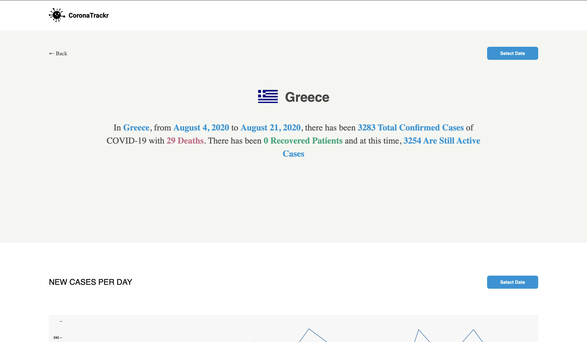
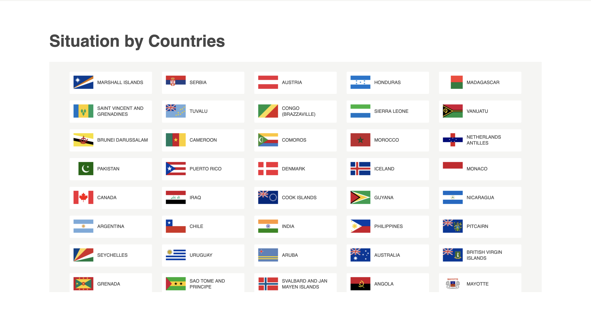
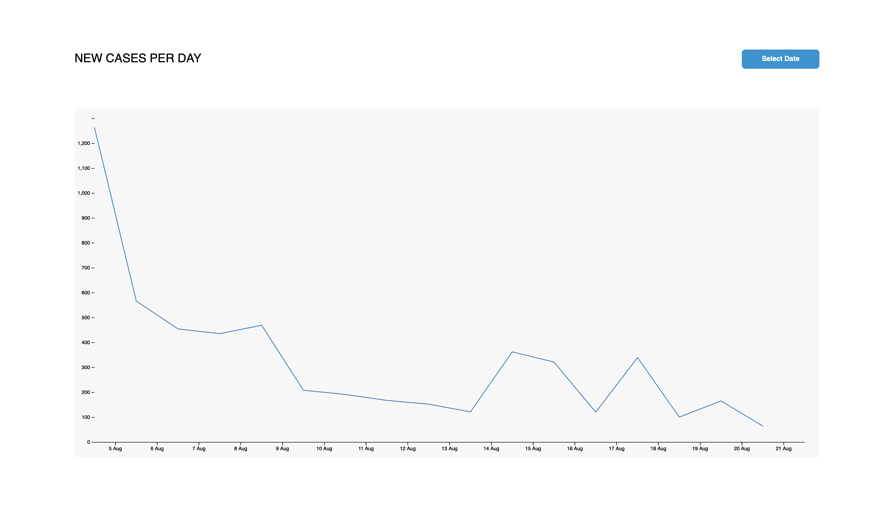

# CoronaTrackr

It involves consuming the "COVID19 API" and displaying them in a neat layout for user consumption. 

## Tech Used

- React
- React Query
- D3Js
- Date Picker
- React Router

### Completed Task

 - [x] Homepage
 - [x] Country list
 - [x] Confirmed cases
 - [x] deaths
 - [x] active cases
 - [x] daily cases map

### TODO

 - [ ] monthly picker for map
 - [ ] map update
 - [ ] Recovered, Active and Deaths map

 
